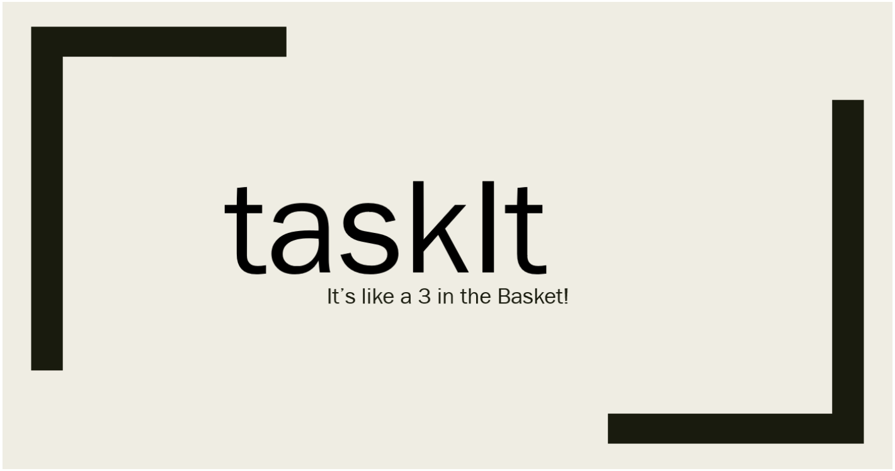

# TaskIt
Software Designed for Time Management in Procrastinating Students

# Inspiration
During our CEGEP career and even today during our University studies, we have been struggling with time management with our hectic schedules, this program goal is to help students with similar issues get their schedules together.

# What it does
Our vision was to make an application called TaskIt. TaskIt is a program made to facilitate time management for students of any age range or level of education. Using input variables, such as one’s schedule, work hours, and a few questions asked upon the first opening of the app, it generates a schedule, partitioning your study for each class, taking into consideration how comfortable one is with any given class as well as the weight of one’s class if applicable. This means that the program will allow more time during study breaks to classes worth more, and classes that one struggles with more than others (determined in the survey).

# How we built it
Due to our currently minuscule knowledge in programming, we were only able to code a very basic, but efficient guideline to how our program works.

# Challenges we ran into
As a team, we were confused about where we needed to begin, as we had very limited knowledge of programming.

#Accomplishments that we are proud of
We actually Started and did Something!!! We are also very proud of our idea.

# What We learned
Our knowledge gained from school is very limited and we hardly scratched the surface of what needs to be known when making a program

# What's next for TaskIt!
We need to get an actual up and running functional app!
